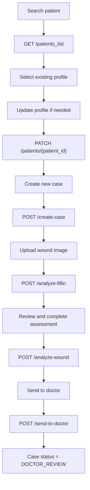
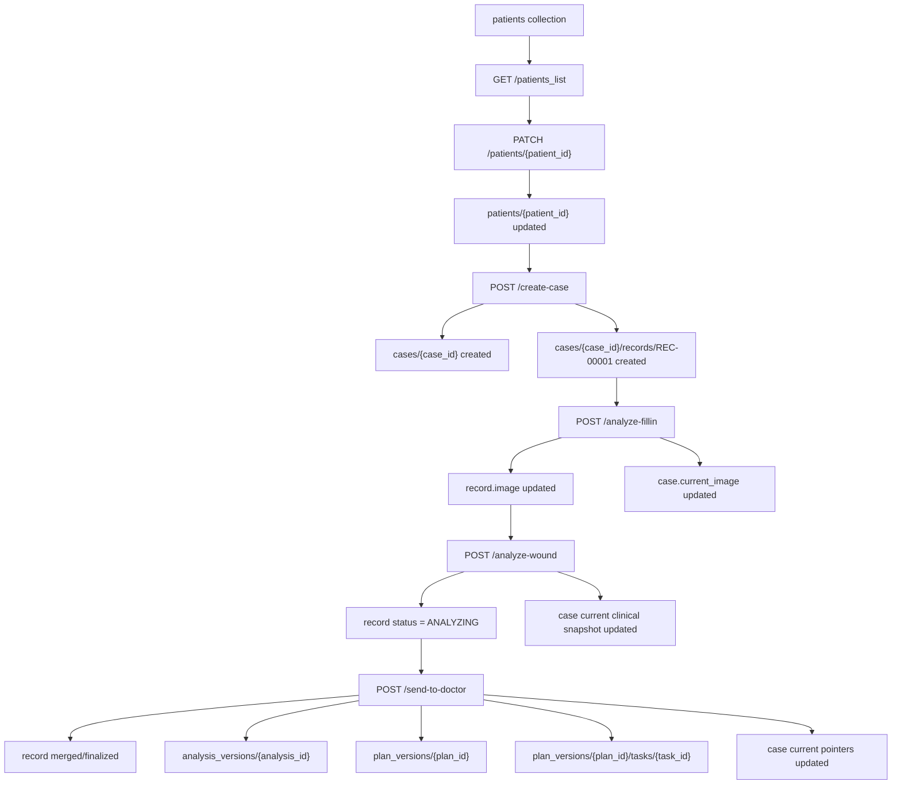
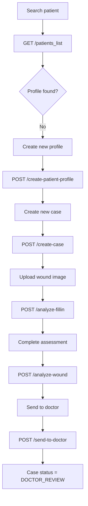
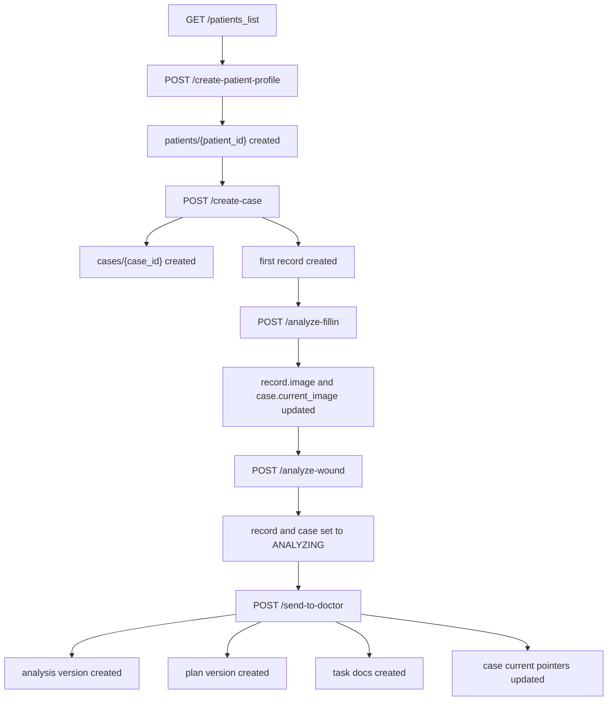
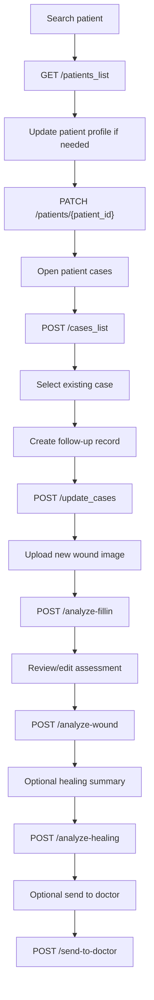
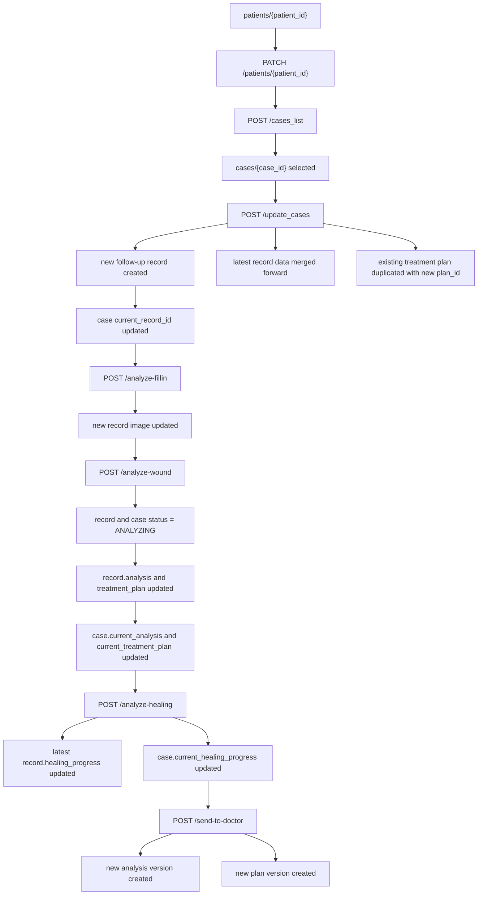
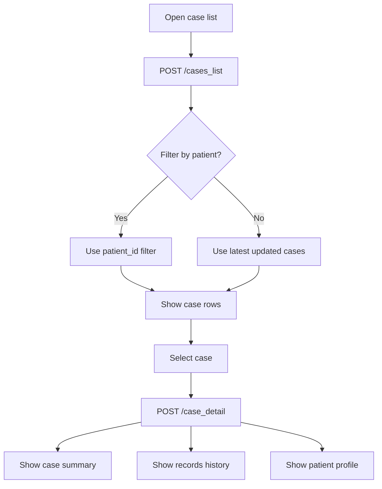
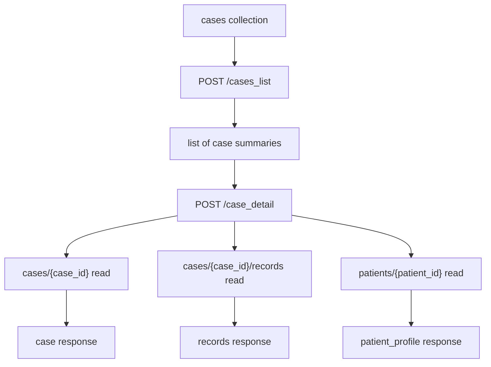
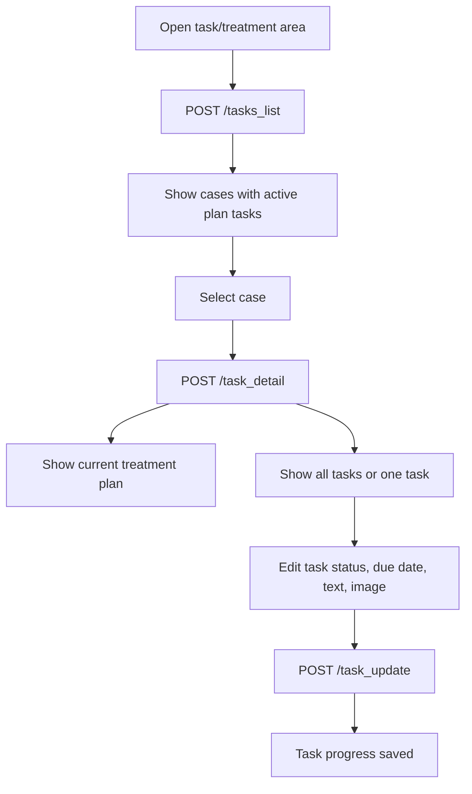
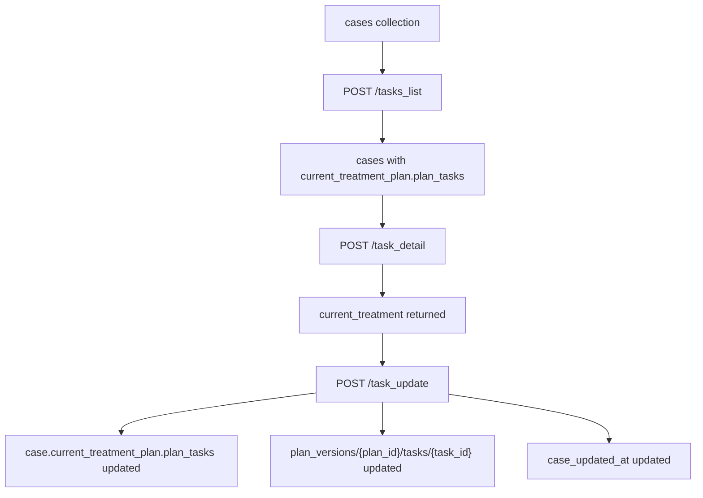

# Workflow Summary

This document summarizes the practical workflows implemented by the current backend.

Each scenario is split into:

1. User workflow
2. Program (data) workflow

The flows below are based on the current route behavior in [`routes/patients.py`](/c:/Users/Pawarit/Desktop/GitHub/Foster-Ulcer-AI/Foster-Ulcer-AI/backend/routes/patients.py), [`routes/cases.py`](/c:/Users/Pawarit/Desktop/GitHub/Foster-Ulcer-AI/Foster-Ulcer-AI/backend/routes/cases.py), [`routes/analysis.py`](/c:/Users/Pawarit/Desktop/GitHub/Foster-Ulcer-AI/Foster-Ulcer-AI/backend/routes/analysis.py), and [`routes/task.py`](/c:/Users/Pawarit/Desktop/GitHub/Foster-Ulcer-AI/Foster-Ulcer-AI/backend/routes/task.py).

## 1. Create Case

### 1.1 Branch: Existing Profile

#### Mermaid

#### User workflow

1. User searches for an existing patient profile.
2. User selects the patient profile from the patient list.
3. User updates profile details if intake information has changed.
4. User starts a new case for that patient.
5. User records initial vital signs.
6. User uploads a wound image for fill-in assistance.
7. User reviews or completes the wound assessment form.
8. User submits the wound for AI analysis.
9. User sends the completed case to doctor review.

#### Program (data) workflow

1. `GET /patients_list`
   - Reads `patients` collection ordered by `created_at` descending.
   - Returns matching patient records to the client.
2. `PATCH /patients/{patient_id}`
   - Merges non-null profile fields into `patients/{patient_id}`.
   - Updates `synced_at`.
3. `POST /create-case`
   - Generates new `case_id` and first `record_id = REC-00001`.
   - Creates `cases/{case_id}`.
   - Creates `cases/{case_id}/records/{record_id}`.
   - Initializes current snapshot fields on the case.
4. `POST /analyze-fillin`
   - Uploads wound image to storage.
   - Updates `records/{record_id}.image.image_folder_url`.
   - If this is the current record, also updates `cases/{case_id}.current_image`.
   - Returns structured fill-in analysis from AI.
5. `POST /analyze-wound`
   - Updates current record with submitted `nurse_reviewed` sections.
   - Sets record and case status to `"ANALYZING"`.
   - Updates case `current_*` wound/clinical snapshots.
   - Runs layered AI analysis.
   - Stores returned `AI_analysis` into record `analysis` and case `current_analysis`.
   - Stores returned `treatment_plan` into record `treatment_plan`, record `task_list`, and case `current_treatment_plan`.
6. `POST /send-to-doctor`
   - Merges completed record payload into the existing record.
   - Generates `analysis_id` and `plan_id`.
   - Creates `analysis_versions/{analysis_id}`.
   - Creates `plan_versions/{plan_id}` and task documents.
   - Sets case status to `DOCTOR_REVIEW`.
   - Updates case `current_record_id`, `current_analysis_id`, `current_plan_id`, and current snapshots.

#### Data flow Mermaid

### 1.2 Branch: New Profile

#### Mermaid

#### User workflow

1. User searches for a patient profile and does not find one.
2. User creates a new patient profile.
3. User optionally uploads a patient profile image.
4. User starts a new case for the new patient.
5. User records initial vital signs.
6. User uploads wound image and reviews the AI fill-in result.
7. User completes the assessment form.
8. User submits the wound for AI analysis.
9. User sends the completed case to doctor review.

#### Program (data) workflow

1. `GET /patients_list`
   - Reads available patient profiles.
2. `POST /create-patient-profile`
   - Generates a new `patient_id`.
   - Uploads optional profile image.
   - Creates `patients/{patient_id}`.
   - Stores `photo_url` if image exists.
3. `POST /create-case`
   - Generates new `case_id` and `record_id`.
   - Creates case and first record documents.
   - Stores initial vital signs and empty clinical sections.
4. `POST /analyze-fillin`
   - Uploads wound image.
   - Stores image URL on the record and current case snapshot.
   - Returns structured fill-in analysis.
5. `POST /analyze-wound`
   - Stores nurse-reviewed clinical sections.
   - Marks case and record as `"ANALYZING"`.
   - Runs three-layer AI analysis.
   - Stores `AI_analysis` and `treatment_plan` onto the active record and case snapshot immediately.
6. `POST /send-to-doctor`
   - Finalizes record data.
   - Creates analysis version, plan version, and task records.
   - Marks case as `DOCTOR_REVIEW`.

#### Data flow Mermaid

## 2. Follow Up Case

### Mermaid

### User workflow

1. User searches for the patient.
2. User updates patient profile details if needed.
3. User opens the patient case list.
4. User selects an existing case to continue.
5. User starts a follow-up entry for that case.
6. User records new vital signs.
7. User uploads a new wound image.
8. User reviews or edits the wound assessment.
9. User submits the wound for AI analysis.
10. User optionally requests healing-progress analysis across records.
11. User sends the updated record to doctor review if needed.

### Program (data) workflow

1. `GET /patients_list`
   - Reads patient profiles.
2. `PATCH /patients/{patient_id}`
   - Updates changed profile fields.
3. `POST /cases_list`
   - Reads cases.
   - If `patient_id` is provided, filters cases by patient.
4. `POST /update_cases`
   - Validates `case_id` and patient ownership.
   - Computes next `record_id`.
   - Creates a new follow-up record under the selected case.
   - Merges forward non-null data from the latest/current record into the new record.
   - Carries forward previous `treatment_plan`, `task_list`, and `analysis` when present.
   - If a treatment plan exists, duplicates it with a new `plan_id` for the new record.
   - Updates the case current snapshot to point at the new record.
5. `POST /analyze-fillin`
   - Uploads the new wound image.
   - Stores image URL on the follow-up record.
   - Updates case current image if the new record is current.
6. `POST /analyze-wound`
   - Writes new nurse-reviewed clinical data into the follow-up record.
   - Updates case status and current clinical snapshot fields.
   - Runs AI analysis.
   - Stores `AI_analysis` and `treatment_plan` onto the follow-up record and current case snapshot.
7. `POST /analyze-healing`
   - Reads all records for the case in chronological order.
   - Sends records and available images to the AI model.
   - Stores returned healing summary on the latest record and case current snapshot.
8. `POST /send-to-doctor`
   - Optional finalization step if the follow-up record should be sent for doctor review.
   - Creates new analysis and plan version records tied to the follow-up record.

### Data flow Mermaid

## 3. Case List -> Case Detail

### Mermaid

### User workflow

1. User opens the case list screen.
2. User optionally filters by patient.
3. User selects a case from the list.
4. User views case summary, patient profile, and record history.

### Program (data) workflow

1. `POST /cases_list`
   - Reads from `cases`.
   - With no filter: orders by `case_updated_at` descending.
   - With `patient_id`: filters by patient.
   - Returns case summary rows to the client.
2. `POST /case_detail`
   - Reads the selected `cases/{case_id}` document.
   - Reads `cases/{case_id}/records` ordered by `record_created_at` ascending.
   - Reads `patients/{patient_id}` if the case contains a patient reference.
   - Returns:
     - `case`
     - `records`
     - `patient_profile`

### Data flow Mermaid

## 4. Treatment Execution Plan

### Mermaid

### User workflow

1. User opens the task or treatment execution area.
2. User sees cases that currently have active plan tasks.
3. User selects one case to inspect the treatment plan.
4. User views all tasks or one specific task.
5. User updates task progress, due date, completion time, text, or task image.
6. User saves task execution progress.

### Program (data) workflow

1. `POST /tasks_list`
   - Reads cases ordered by `case_updated_at` descending.
   - Loads patient names for the listed cases.
   - Keeps only cases whose `current_treatment_plan.plan_tasks` is a non-empty list.
   - Returns an array in the `current_treatment_plan` response field.
2. `POST /task_detail`
   - Reads the selected case.
   - Reads patient name from patient profile if available.
   - Returns `current_treatment`.
   - Returns either:
     - `plan_tasks` for the whole plan, or
     - `task` for a selected `task_index`
3. `POST /task_update`
   - Validates the case and current plan linkage.
   - Parses the submitted `updates` JSON list.
   - Optionally uploads one image per update item.
   - Updates tasks inside `cases/{case_id}.current_treatment_plan.plan_tasks`.
   - Updates task documents under:
     - `cases/{case_id}/records/{current_record_id}/plan_versions/{current_plan_id}/tasks/{task_id}`
   - Updates `case_updated_at`.
   - Returns `updated_task_ids`.

### Data flow Mermaid

## 5. Flow Relationships

### User-side relationship

- Create case starts from patient search.
- Follow-up case starts from patient search, then case selection.
- Case list to case detail is the read-only navigation path into case history.
- Treatment execution plan starts from the current plan/task list and continues into task updates.

### Data-side relationship

- Patient profile is the entry point for both create-case and follow-up flows.
- Case is the long-lived container for records, current snapshots, and current plan pointers.
- Record is the time-based clinical snapshot for each create or follow-up step.
- Analysis version and plan version are generated when the case is sent to doctor review.
- Task execution updates both:
  - the case current treatment snapshot
  - the current plan-version task documents under the current record

## 6. Important Current Implementation Notes

- Follow-up records inherit many values from the latest/current record through non-null merge logic.
- `/analyze-wound` writes case status as `"ANALYZING"`, even though that value is not part of the declared `Status` enum.
- `/tasks_list` returns its array under `current_treatment_plan`, not `tasks`.
- `send-to-doctor` is the step that creates official analysis and plan version subcollections.
- Healing analysis is separate from wound analysis and only runs when `/analyze-healing` is called.
